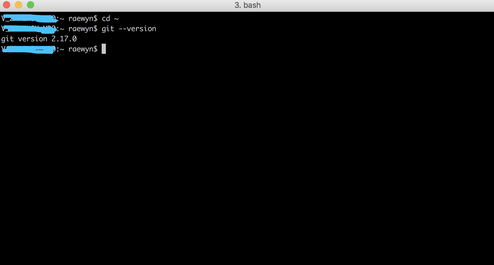
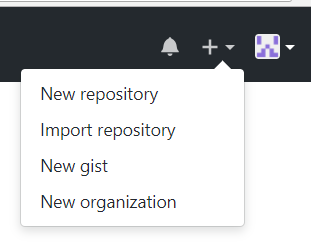
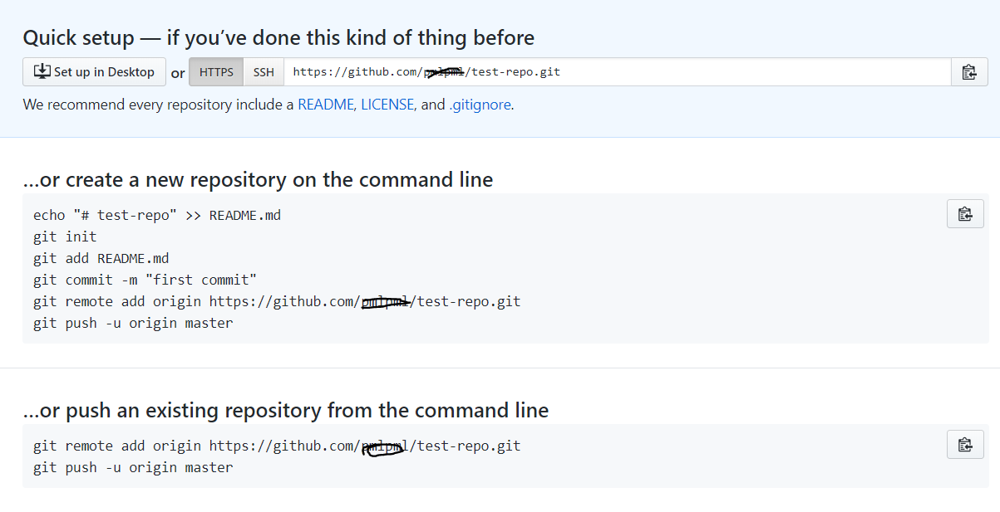
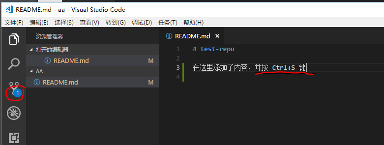
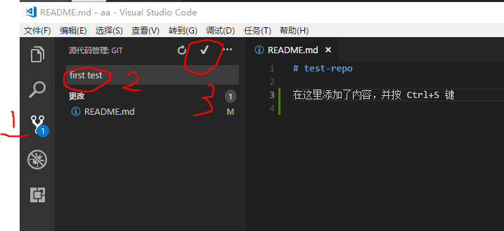
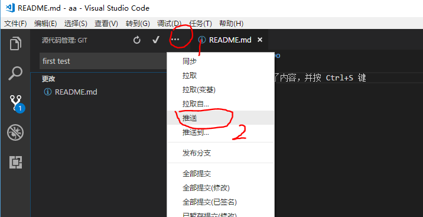
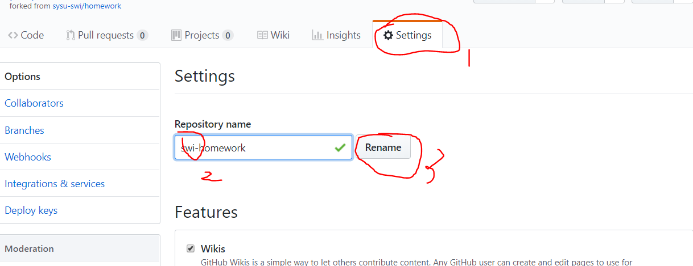
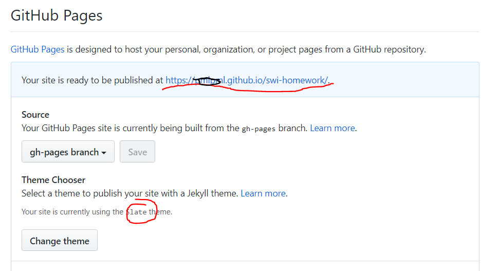
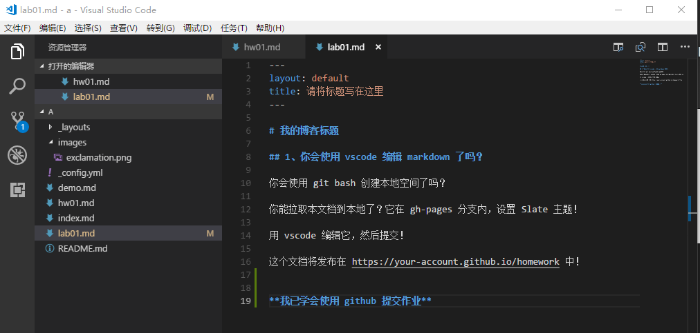
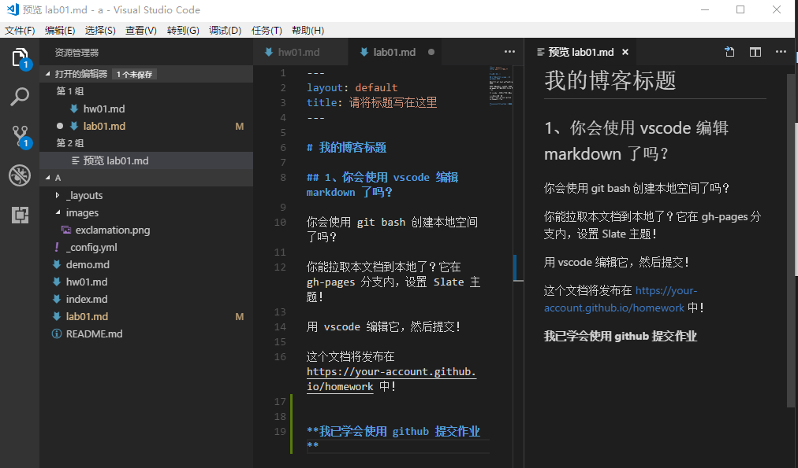

# 使用 Git 提交作业
{:.no_toc}

* 目录
{:toc}

## 1、Github What & Why

gitHub 是一个面向开源及私有软件项目的托管平台。作为开源代码库以及版本控制系统，Github拥有超过千万开发者用户，随着越来越多的应用程序转移到了云上，Github已经成为了管理软件开发以及发现已有代码的首选平台。

* 使用 Github，管理你的大学阶段乃至未来你所有的程序代码，观察自己的成长轨迹。
* 使用 Github，组建自己的软件开发团队或加入其他团队，与全球伙伴协同开发有趣的软件。
* 使用 GitPage，依托 Github，作为文档托管空间，介绍你的项目、记录与分享技术学习经验。
* 使用 GitPage，建立你的专业、个性化的博客，突出作为计算机专业学生的优势。

用 github 做作业，你需要注意的事项：

* 系统会记录你提交内容的历史，且无法删除
* 作业是公开的，任何人都可以随时检查
* 请慎言！在 github 上 **妄议时政** 是低级、可笑的错误

## 2、Github 环境准备

### 2.1 注册 Github 账号

进入 [github ⽹站](https://github.com/) 注册⼀个⾃⼰的账户

`https://github.com/your-account` 就是你 Github 的首页。你所有的文档、代码及其历史都保存在其中的仓库（Repositories
）中。


### 2.2 安装 git 管理⼯具

从 [git 工具官⽹](https://git-scm.com/downloads) 直接下载安装程序，按提示选择合适系统安装。


github下载文件，**[提示链接超时的问题解决办法](https://blog.csdn.net/cym1990/article/details/78173128)**

**windows 用户**

安装完成后，在开始菜单⾥找到“Git”->"Git Bash"，点击跳出类似命令⾏的窗⼝（[MinGW](http://mingw.org/)），说明安装成功！


这是一个简单的 Unix bash，常用的 Unix 命令都能执行。

* 命令 `git --version` 显示 git 工具的版本
* 命令 `cd ~` 进入用户根目录

**Mac 用户**

安装完成后，打开终端输入一下命令，出现以下提示，说明安装成功！

* 命令 `cd ~` 进入用户根目录
* 命令 `git --version` 显示 git 工具的版本

**Linux 用户**

期待你的补充

### 2.3 配置 git 用户

打开 git bash 工具的用户名和密码存储

```
$ git config --global user.name "Your Name"
$ git config --global user.email "email@example.com"
$ git config --global credential.helper store
```

注意：邮箱必须与 github 注册邮箱一致

以后，只要第一次提交输入密码，以后就 **免密码** 了！

`cat .gitconfig` 你就知道上述操作的内容，手工编辑该文件也行！

### 2.4 安装 vscode

[vscode](https://code.visualstudio.com/)，以不变应万变的编程神器，除了 Java 外，你大学阶段的编程工具就搞定了！

window、mac、linux 通杀的平台，还不快到[官网]((https://code.visualstudio.com/))，下载安装。

当然 vscode 是目前最强大的跨平台 markdown 编辑工具！ 

## 3、开始作业之旅

### 3.1 初识仓库

**创建新仓库**

1、登陆 github 网站   
2、网页右上角 `+` 菜单，`New repository`  



3、输入仓库名字，例如 `test-repo`, 然后按 `Create repository`  
4、这时转入 `https://github.com/user/test-repo` 即该仓库主页。在仓库为空时，显示本地仓库常见的命令。  



5、在本地机器创建一个目录作为本地仓库，例如：`test-cat`  
6、使用上下文菜单（目录上点右键），选择 `Git bash Here`，打开 MinGW 窗口。如果是其他平台，打开终端  
7、拷贝 create a new repository 下面的命令，粘贴到命令窗口  
8、等执行结束，看到 `Writing objects: 100%` 字样  
9、刷新浏览器，你会看到仓库中有了 `README.md` 文档  

**使用仓库**

1、启动 vscode  
2、菜单 文件 --\> 打开文件夹，打开仓库所在的目录  
3、你可以修改 README.md 或 创建新文件，变化会显示在`源代码管理页面`   



4、确认变化提交（Commit）本地，步骤见图



5、推送（Push）到 github 网站的仓库



6、刷新浏览器，你会看到仓库中 `README.md` 文档的变化

### 3.2 创建作业仓库

**Fork作业模板**

1、从[作业模板](https://github.com/sysu-swi/homework)仓库 Fork 到你的账号  
2、稍后片刻，在你的账号下就出现了 homework 这个仓库  
3、修改仓库名，如 swi-homework  



同时，该作业仓库 setting 菜单中出现了作业发布的网页地址



4、在新标签页打开该地址，漂亮的网站就有了！ （可能出现 404 错误，生成这个网站需要等一会）  

**复制到本地仓库**

最简单的方法，直接在一个目录下 clone 你的远程仓库

```
$ git clone https://github.com/user/swi-homework.git
```

这时该目录下出现了本地仓库 `swi-homework`

另一种是先创建作业目录，例如 `swi-homework`， 然后在该目录启动 git bash， 执行以下命令

```
$ git init
$ git git remote add origin https://github.com/user/swi-homework.git
$ git pull
$ git checkout master
```

**选择分支**

作业模板有两个分支，master 和 gh-pages，gh-pages 包含了作业文档

使用 vscode 打开作业目录，在 vscode 左下方，选择分支


### 3.3 编辑并提交第一次作业

把 github 仓库复制到本地后

**作业空间结构**

用 vscode 编辑作业。作业空间如图所示：



* `index.md` 网站首页，作业索引页
* `demo.md` 是 Markdown 语法演示页，包括标题、强调、表格、连接、图片、公式等的使用
* `_config.yml` 是网站配置页
* `images` 是保存图片的目录
* `hw??.md lab??.md` 是作业文件

**常用快捷键**

`Ctrl S` 保存编辑内容  
`[Ctrl K] + V` 预览 Markdown 效果  



提交作业并推送到 github 仓库，几分钟后漂亮的作业网站看到了！ 

--- **开启 markdown 做作业之旅吧！**


